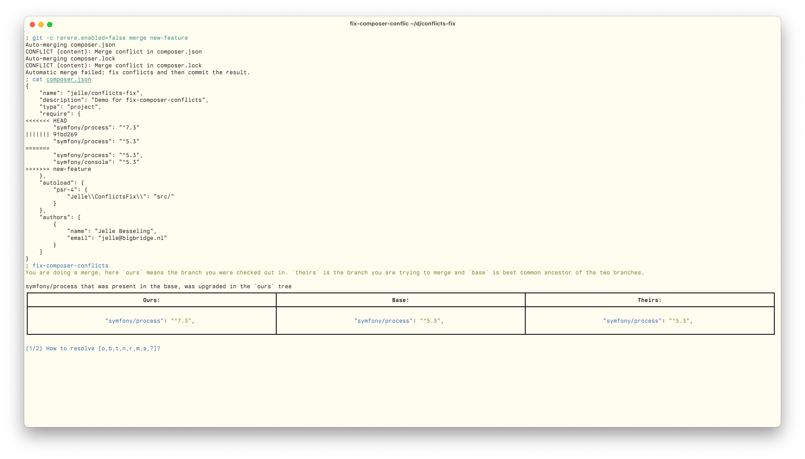

# fix-composer-conflicts

Fix composer conflicts with some help.

## Installation

The easiest way to install is using `composer global require`.

```bash
composer global require pingiun/fix-composer-conflicts
```

Then you can find the tool in your composer home directory.
Use this command to find out where it is:

```bash
composer global config home
```

You could add this directory (with /vendor/bin appended) to your `PATH` variable if you want to run it easily.

Bash single-liner if you're lazy:

```bash
echo 'export PATH="$PATH:$(composer global config home)/vendor/bin"' >> ~/.bashrc && source ~/.bashrc
```

Note, this tool requires PHP 8.3 or higher.

## Usage

If you are doing a merge, rebase or cherry-pick and you get a git conflict in your `composer.json` file, you can use this tool to fix it.
Run the following command in the root of your project:

```bash
fix-composer-conflicts
```

You will get an interactive prompt like this:

[](./screenshot.png)

If you need help with the single letter commands, you can type `?` and hit enter for help.

## How does it work?

After making your choices, the tool checks whether the `ours` version or the `theirs` version of the `composer.json` is closer to what you want.

Then it resets both the `composer.json` and `composer.lock` files to the `ours` version, and then applies any choices you made in the interactive prompt.

It applies the choices by literally just doing `composer require` commands in the background.

Afterwards it adds the `composer.json` and `composer.lock` files to the git index, so you can commit them right away.


## Current limitations

The tool does not try to keep subdependencies locked as they were in the composer.lock file.
This is because it works by just re-requiring the tools, at which point composer will resolve the dependencies again.
This is something I will look into in the future, as it could lead to unexpected changes in the `composer.lock` file.

Another limitation is that every step is still manual, I'd like to have a way to automatically make choices.
PRs are welcome for this!
